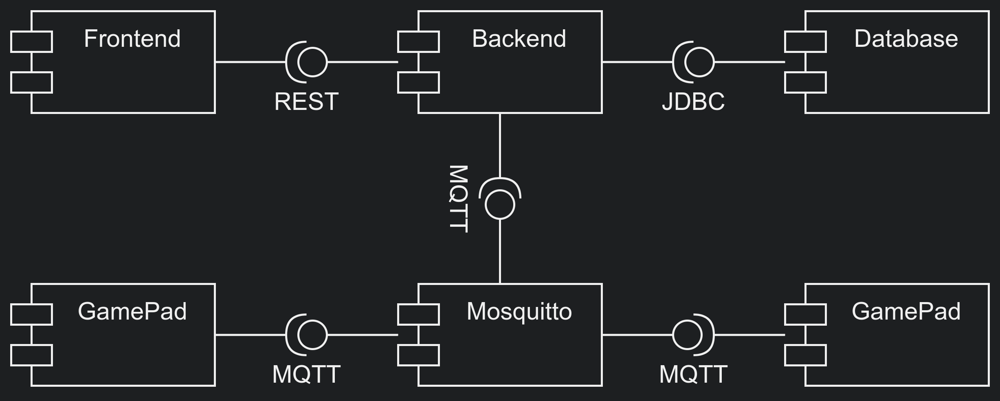

# Multiplayer Trivia Quiz

A multiplayer quiz built as a university group project at THM. Players join a lobby, choose questions and answer with a web controller or the ESP32 hardware controller. The interesting part of this project was connecting browser interfaces, a Java backend, a database and MQTT devices into one game.

## How it fits together

- The **frontend** shows the lobby, game and scores. A separate **web controller** provides browser-based input.
- A **Java / Vert.x** backend exposes a REST API and coordinates game data in **MariaDB**.
- **Mosquitto (MQTT)** carries controller messages, including those from the ESP32 implementation.
- **Docker Compose** starts the services together; Nginx serves the browser interfaces.



## Run locally

You need Docker and Docker Compose. Clone the repository and review the root `.env` values for your local setup. The example credentials in this course project should be changed before running it on a network you do not control.

```bash
git clone https://github.com/Jorxas/quizgame.git
cd quizgame
docker compose up --build
```

Once the containers are ready:

| Component | Local address |
| --- | --- |
| Game frontend | [http://localhost](http://localhost) |
| Web controller | [http://localhost:81](http://localhost:81) |
| Backend API | [http://localhost:8080](http://localhost:8080) |
| phpMyAdmin | [http://localhost:8081](http://localhost:8081) |

To stop the project, run `docker compose down`. The ESP32 controller is optional for exploring the browser-based flow; its PlatformIO project lives in [`arduino/`](arduino/).

## Repository guide

- [`frontend/`](frontend/) and [`web-controller/`](web-controller/) — browser interfaces.
- [`java-backend/`](java-backend/) — Vert.x application.
- [`mariadb/`](mariadb/) and [`mosquitto/`](mosquitto/) — service configuration.
- [`doc/`](doc/) — original course brief, design proposal and technical explanation.

This was collaborative coursework. The original [project description](doc/ProjectDescription.md) and [design proposal](doc/DesignProposal.md) remain available for anyone who wants the assignment context.
